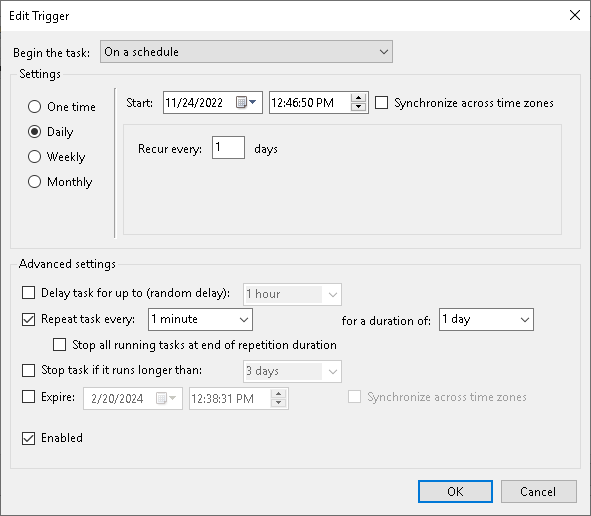
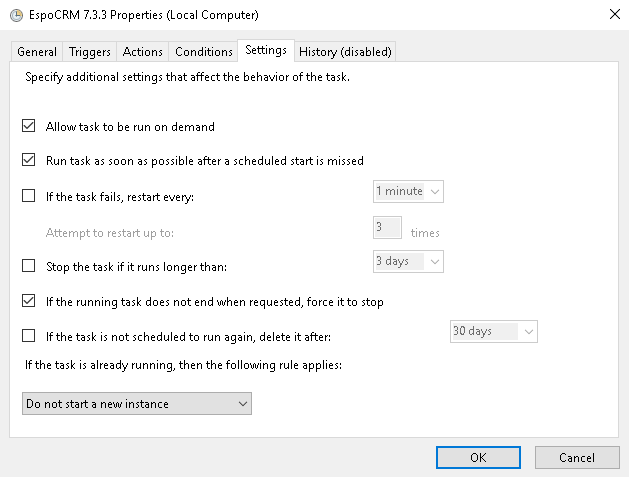

# Server Configuration for EspoCRM

EspoCRM can be installed on:

* [Apache](apache-server-configuration.md), [Nginx](nginx-server-configuration.md), or [IIS](iis-server-configuration.md) server;
* with PHP 8.0, 8.1, 8.2;
* MySQL 5.7 (and later), or MariaDB 10.2.2 (and later).

In this article:

* [Recommendations & requirements](#recommendations-requirements)
* [Required permissions for Unix-based systems](#required-permissions-for-unix-based-systems)
* [Setting up crontab](#setting-up-crontab)
* [Configuration instructions based on your server](#configuration-instructions-based-on-your-server)
* [See also](#see-also)


## Recommendations & requirements

### PHP requirements

EspoCRM requires PHP 8.0, 8.1 or 8.2 with the following extensions:

* [pdo_mysql](https://php.net/manual/en/book.pdo.php) – for database access;
* [gd](https://php.net/manual/en/book.image.php) – to manipulate images;
* [openssl](https://php.net/manual/en/book.openssl.php) – to ensure the highest protection;
* [zip](https://php.net/manual/en/book.zip.php) – to be able to upgrade EspoCRM and install extensions;
* [mbstring](https://php.net/manual/en/book.mbstring.php);
* [iconv](https://php.net/manual/en/book.iconv.php);
* [curl](https://php.net/manual/en/book.curl.php) – for integrations;
* [xml](https://php.net/manual/en/book.xml.php) – for excel export;
* [xmlwriter](http://php.net/manual/en/book.xmlwriter.php) – for excel export;
* [exif](https://php.net/manual/en/book.exif.php) – for a proper oriantion of uploaded images;
* [bcmath](https://www.php.net/manual/en/book.bc.php) – arbitrary precision mathematics;

php.ini settings:

```
max_execution_time = 180
max_input_time = 180
memory_limit = 256M
post_max_size = 50M
upload_max_filesize = 50M
```

Optional php extensions that may be needed:

* [zmq](http://php.net/manual/en/book.zmq.php) – for websocket;
* [pcntl](http://php.net/manual/en/book.pcntl.php) – for parallel job processing and daemon (Unix-like systems only);
* [posix](http://php.net/manual/en/book.posix.php) – for Unix-like systems;
* [ldap](http://php.net/manual/en/book.ldap.php) – for LDAP authentication.


### Database requirements

EspoCRM supports MySQL 5.7 or greater and MariaDB 10.1 or greater. These are no special peculiarities. All default settings are fine for EspoCRM.

### MySQL 8 support

MySQL 8.0.4 has changed a default authentication method to `caching_sha2_password` which is not supported by PHP (at the time of writing). For MySQL 8 it should be changed to `mysql_native_password` method. For a user it can be done with the query:

```
CREATE USER username@localhost identified with mysql_native_password by 'password';
```
where username is your MySQL user, password is your MySQL user password.

## Required permissions for Unix-based systems

**Note**: In most cases permissions are set properly after extracting EspoCRM instance from a zip package. You need only to set ownership.

### Permissions

The files and directories should have the following permissions:

* `data`, `custom`, `client/custom` – should be writable all files, directories and subdirectories (664 for files, 775 for directories, including all subdirectories and files);
* `application/Espo/Modules`, `client/modules` – should be writable the current directory (775 for the current directory, 644 for files, 755 for directories and subdirectories);
* `bin/command` – should be executable (754);
* all other files and directories should be readable (644 for files, 755 for directories).

To set the permissions, execute these commands in the terminal:

```
cd <PATH-TO-ESPOCRM-DIRECTORY>
find . -type d -exec chmod 755 {} + && find . -type f -exec chmod 644 {} +;
find data custom client/custom -type d -exec chmod 775 {} + && find data custom client/custom -type f -exec chmod 664 {} +;
chmod 775 application/Espo/Modules client/modules;
chmod 754 bin/command;
```

### Ownership

All files should be owned and group-owned by the webserver process. It can be *www-data*, *daemon*, *apache*, *www*, etc.

Note: On Bitnami Stack, files should be owned and group-owned by *daemon* user.

Note: On shared hosts, files should be owned and group-owned by your user account.

To set the owner and group-owner, execute these commands in the terminal:

```
cd <PATH-TO-ESPOCRM-DIRECTORY>
chown -R <OWNER>:<GROUP-OWNER> .;
```

## Setting up crontab

Note: More information about jobs in EspoCRM is available [here](jobs.md).

### Unix-like systems

To setup crontab on Unix-like system, take the following steps:

1. Login as administrator into your EspoCRM instance.

2. Go to the Scheduled Jobs section in the administrator panel (Menu > Administration > Scheduled Jobs) and copy the string for the crontab. It looks like this one:

```
* * * * * /usr/bin/php -f /var/www/html/espocrm/cron.php > /dev/null 2>&1
```

3. Open a terminal and run this command:

```
crontab -e -u WEBSERVER_USER
```

WEBSERVER_USER can be one of the following “www”, “www-data”, “apache”, etc (depends on your webserver).

4. Paste the copied string (from step 2) and save the crontab file (Ctrl+O, then Ctrl+X for nano editor).

### Windows

Note that all configuration settings listed here are made on **Windows Server 2019**.

To setup crontab on Windows system, take the following steps:

1. Login as administrator into your EspoCRM instance.

2. Go to the Scheduled Jobs section in the administrator panel (Menu > Administration > Scheduled Jobs) and copy the string for the crontab, replace  *php.exe* instead of *php-cgi.exe* and add *"* symbols to the start and the end of the *php.exe* path. It looks like this one:

```
"C:\Program Files\PHP\v8.2\php.exe" -f C:\inetpub\wwwroot\733\cron.php
```

3. Create a batch file by using Notepad and save with the *.bat* extension with string from step 2.

4. From the Windows Start menu, select Administrative Tools and then Task Scheduler.

5. Create a folder inside Windows directory and Task inside.

6. Configure the Task with the following settings and click `OK`:







7. Right-click on the created Task and Click on `Run`.

## Configuration instructions based on your server

* [Apache server configuration](apache-server-configuration.md)
* [Nginx server configuration](nginx-server-configuration.md)
* [IIS server configuration](iis-server-configuration.md)

## See also

* [Jobs](jobs.md)
* [WebSocket](websocket.md)
* [Performance tweaking](performance-tweaking.md)
